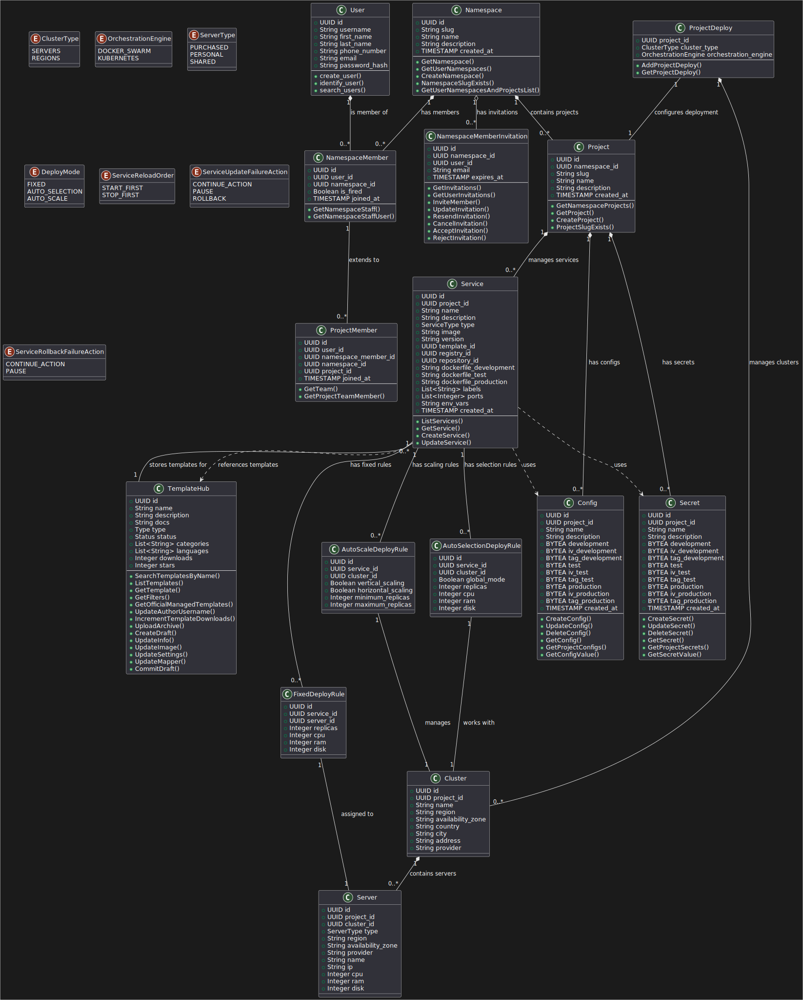
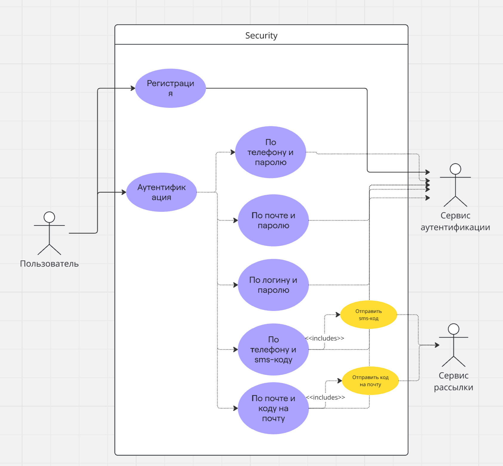
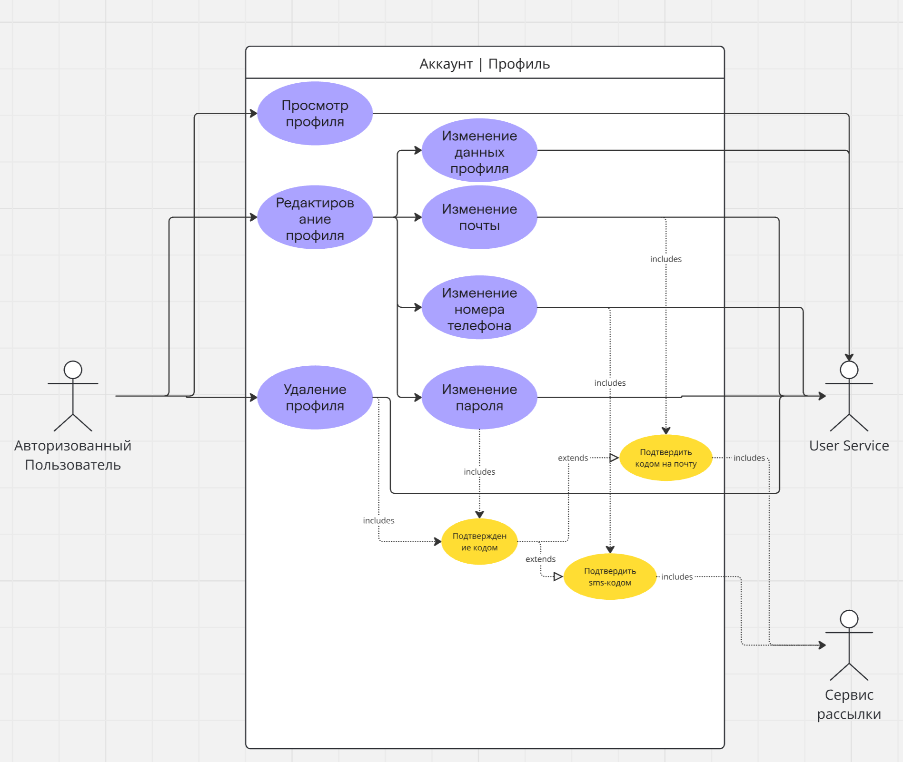
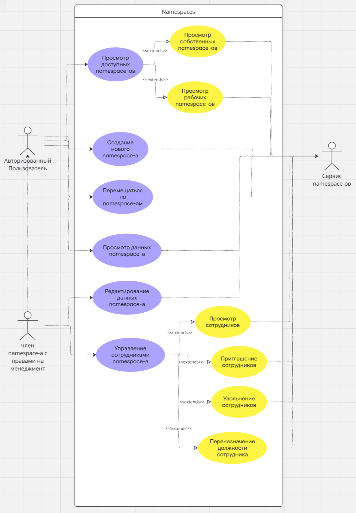
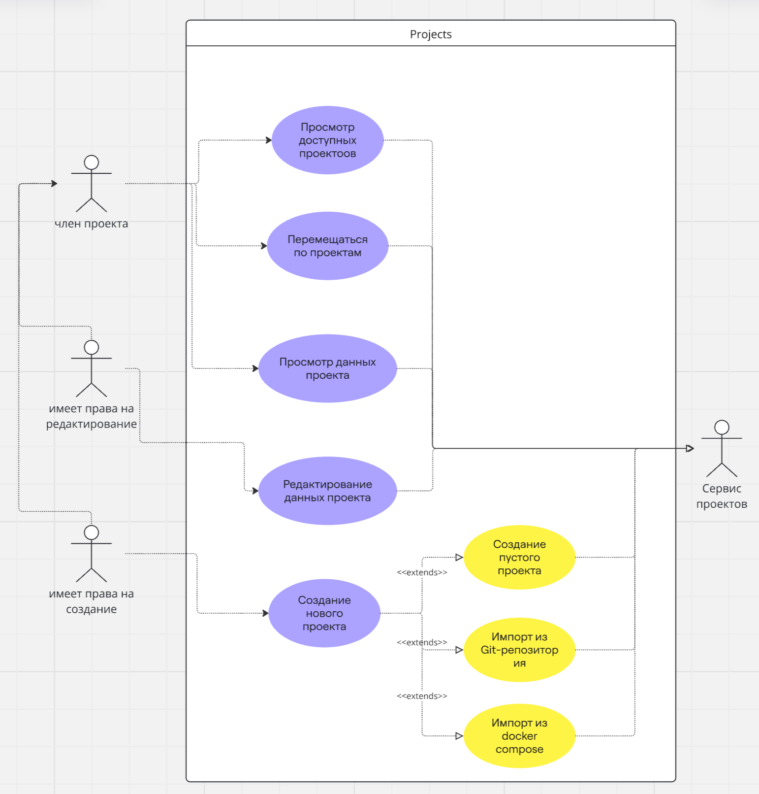
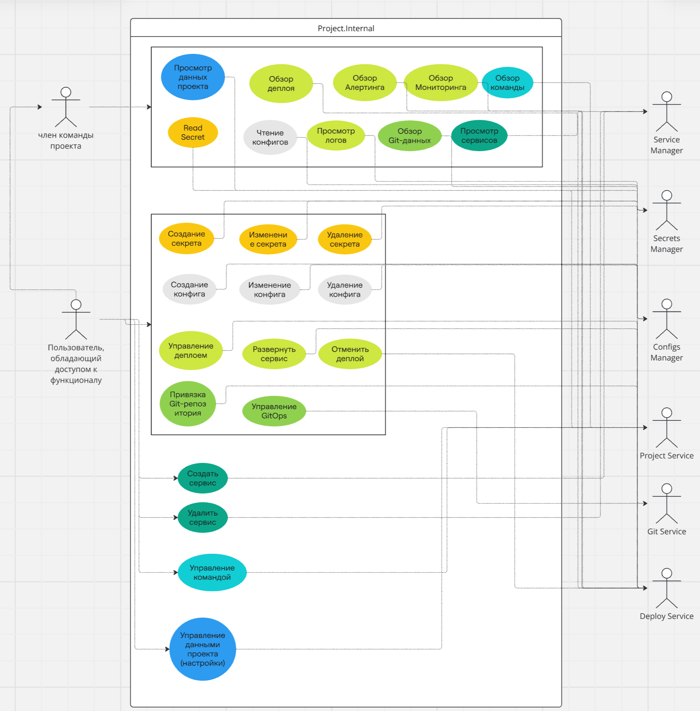
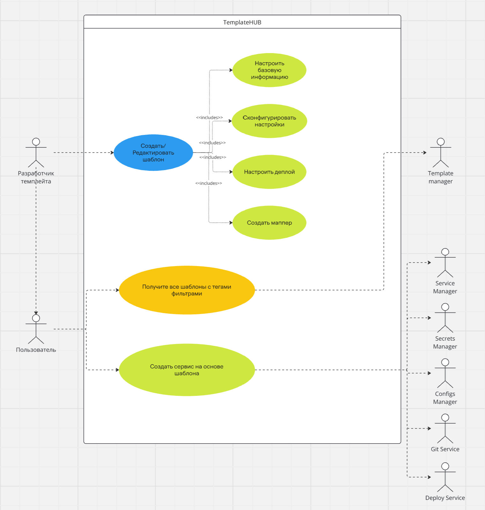
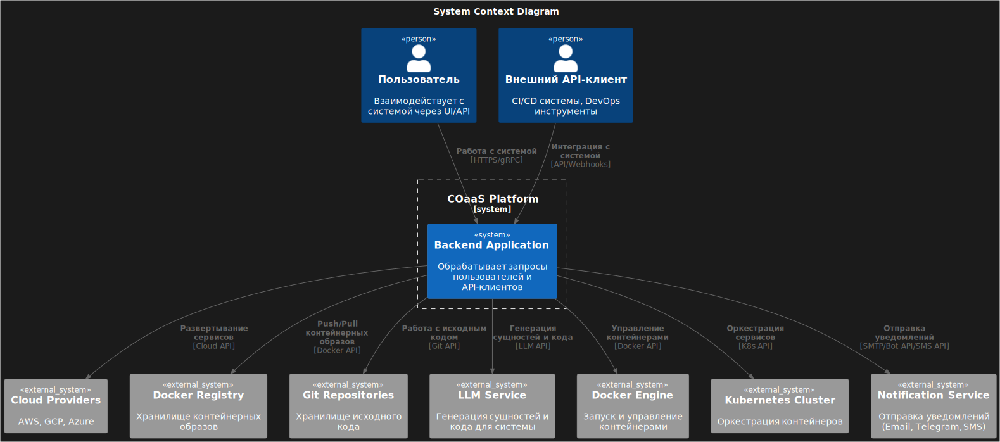

# Проектирование архитектуры программных систем

## Авторы

- Павлычев Артемий Юрьевич, БПИ222
- Шалаев Алексей Дмитриевич, БПИ222

## CloudOps as a Service (COaaS)
**COaaS** - **облачная платформа**, поддерживающая **жизненный цикл разработки программного продукта**, включающая в себя:  
- **Менеджмент проектов**  
- **Автоматический деплой сервисов**  
- **Поддержание DevOps методологии** на основе **GitOps** и **CI/CD процессов**  

---

### 🔥 **Без формальностей** 🔥  
Представьте, вы компания **ООО "Янклекс"** и у вас **много проектов**, в которых есть:  
✅ **Базы данных**  
✅ **Хранилища**  
✅ **Брокеры сообщений**  
✅ **Микросервисы**  
✅ **Секреты** (*пароли, подключения к БД, токены*)  
✅ **Конфиги** (*балансеры, системные настройки и т.д.*)  

---

### **Как это работает в нашей системе?**  

🔹 У вас есть **namespace** → `yanclex`  
🔹 В нем есть **projects** → _ЯИзвочик_, _ЯГусли_, _ЯЗрелище_, _..._  
🔹 В **namespace** находятся сотрудники  
🔹 В каждом **проекте** своя **команда**  

⚡ **Роли не фиксированы!**  
_(Мы отказались от стандартных Owner, Maintainer, Developer, DevOps в пользу **гибкой системы прав доступа (IDM)**)_  

---

### **Как устроены проекты?**  

В **каждом проекте** есть **сервисы**:  
- **Веб-серверы** 🌍  
- **Клиенты** 📲  
- **Базы данных** 🗄  
- **Хранилища** 📦  
- **Брокеры сообщений** 🔄  

💡 **Любой docker-контейнер для нас — это сервис!**  

🛠 **Секреты и конфиги** — важная часть, но мы не выделяем их отдельно, они **обеспечивают безопасность и удобство работы сервисов**.

---

### **GitOps и CI/CD**  

🌀 **GitOps** → **Привязка Git-репозитория**, **выбор модели ветвления** (_GitFlow, Trunk-based и т.п._), **настройка CI/CD**  
🚀 **Деплой** → Развертывание контейнеров по **нодам**  

---

🎯 **COaaS = Полный контроль над DevOps-процессами**  

🔥 **Автоматизация, безопасность и удобство в одном месте!**  

# Анализ задачи • Моделирование и архитектурно-значимые функциональные требования

## Модель предметной области

## Модель прецедентов

Так как в системе много областей, мы разбили на скоупы для удобного восприятия.

1. Security - регистрация, аутентификация, авторизация.

2. Profile - взаимодействие с профилем.

3. Namespaces - верхнеуровневое объединение проектов.

4. Projects - проекты.

5. Internal Project - взаимодйствие с сущностями проекта.

6. Template Hub - маркетплейс шаблонов сервисов. (аналог DockerHub, только более продвинутый)

## 4К модель: уровень Контекст

